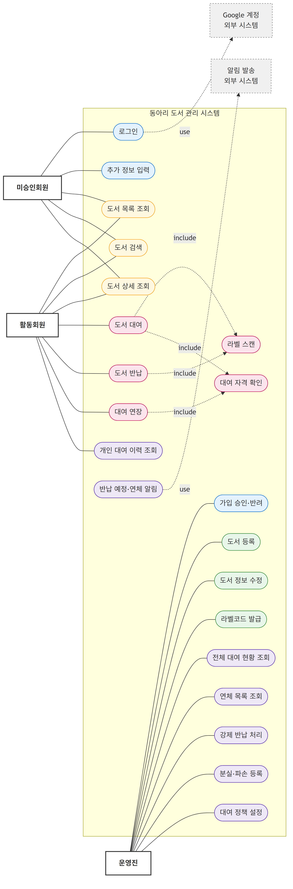
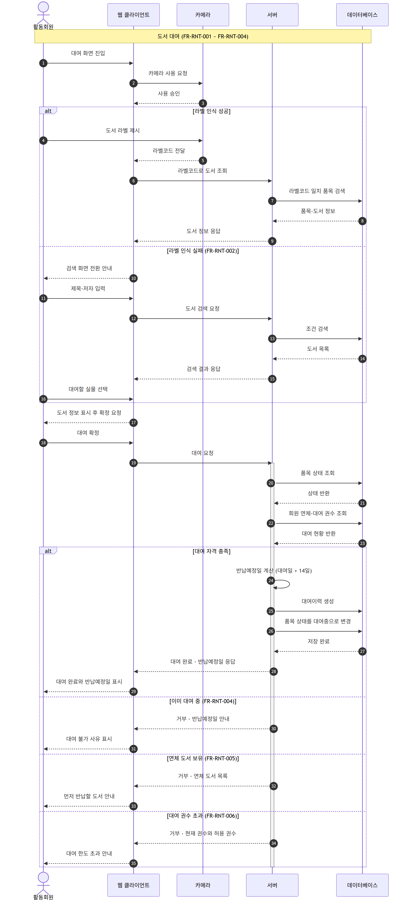
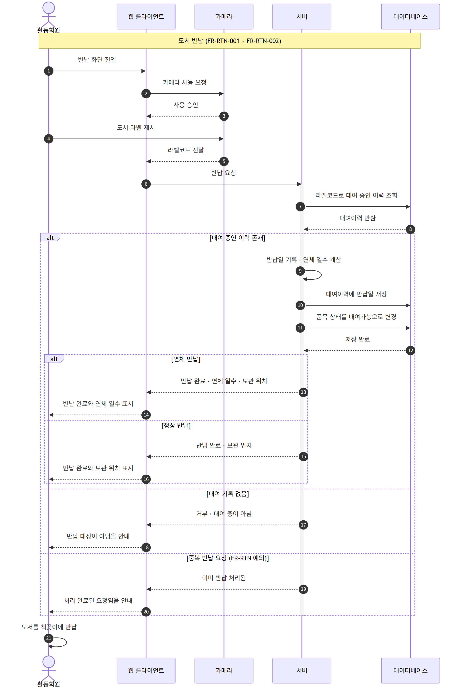
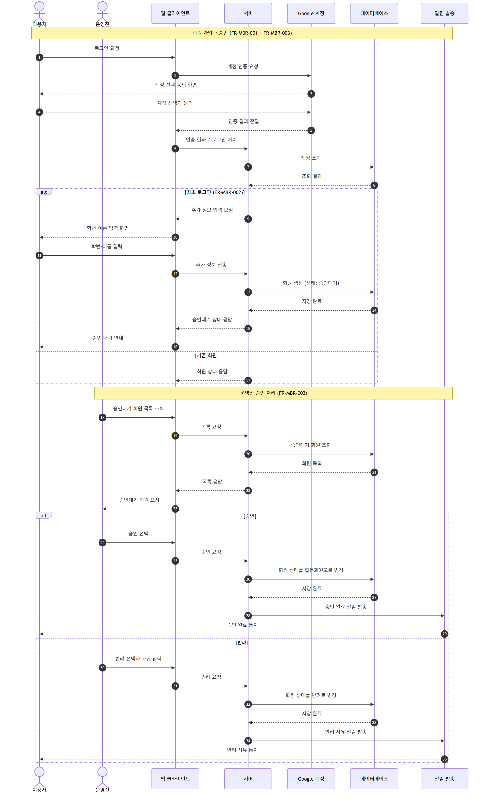
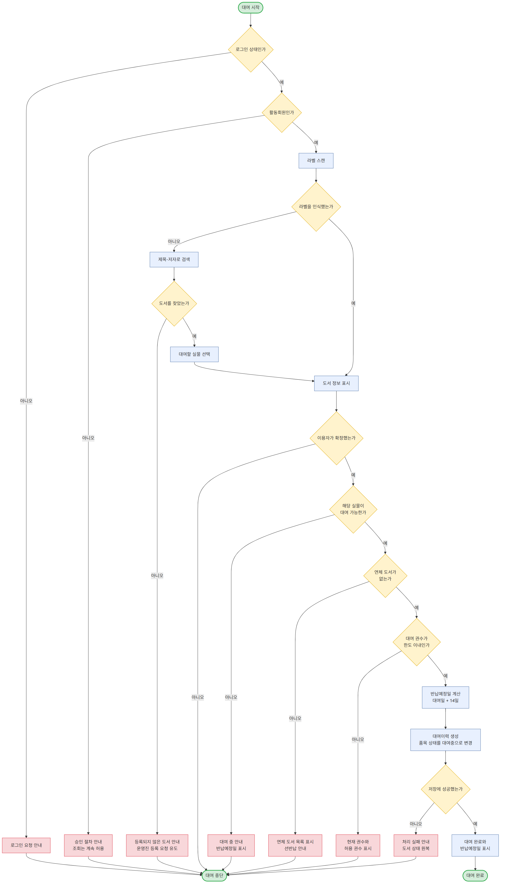
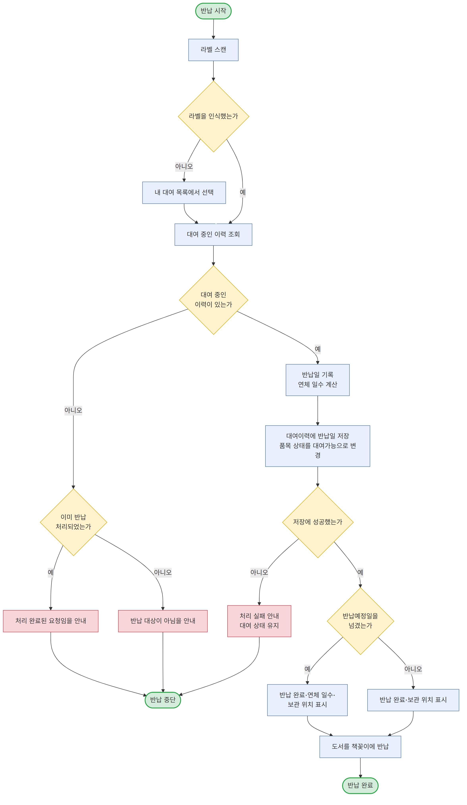

# 동아리 도서 관리 시스템 다이어그램

| 구분 | 내용 |
| --- | --- |
| 문서명 | 동아리 도서 관리 시스템 다이어그램 |
| 버전 | v1.0 |
| 작성일 | 2026-08-08 |
| 근거 문서 | docs/planning/requirements-definition.md |

---

# 1. 문서 개요

## 가. 작성 목적

이 문서는 요구사항을 그림으로 정리한다. 글로만 적힌 흐름은 파트마다 다르게 읽힌다. 디자인, 프론트엔드, 백엔드가 병렬로 작업하므로 공통된 그림이 필요하다.

## 나. 수록 범위

| 구분 | 다이어그램 | 대상 | 파일 |
| --- | --- | --- | --- |
| 1 | 유스케이스 다이어그램 | 시스템 전체 | use-case-diagram |
| 2 | 시퀀스 다이어그램 | 도서 대여 | sequence-rental |
| 3 | 시퀀스 다이어그램 | 도서 반납 | sequence-return |
| 4 | 시퀀스 다이어그램 | 회원 가입·승인 | sequence-signup |
| 5 | 순서도 | 도서 대여 처리 | flowchart-rental |
| 6 | 순서도 | 도서 반납 처리 | flowchart-return |

## 다. 파일 구성

원본은 Mermaid 형식으로 관리하고 이미지를 함께 보관한다. 원본을 고치면 이미지를 다시 생성한다.

| 구분 | 경로 | 용도 |
| --- | --- | --- |
| 원본 | docs/planning/diagrams/*.mmd | 수정 대상 |
| 이미지 | docs/planning/diagrams/*.png | 문서 첨부·공유 |
| 이미지 | docs/planning/diagrams/*.svg | 확대 열람 |

## 라. 이미지 재생성 방법

### 1) 기본 명령

```bash
npx -y @mermaid-js/mermaid-cli -i <파일명>.mmd -o <파일명>.png -s 3 -b white
```

### 2) 브라우저를 찾지 못하는 경우

렌더러는 내부적으로 브라우저를 사용한다. 브라우저를 자동으로 내려받지 못하면 설치된 브라우저 경로를 지정한다.

```json
{
  "executablePath": "C:/Program Files/Google/Chrome/Application/chrome.exe",
  "args": ["--no-sandbox"]
}
```

```bash
npx -y @mermaid-js/mermaid-cli -p puppeteer.json -i <파일명>.mmd -o <파일명>.png -s 3 -b white
```

---

# 2. 유스케이스 다이어그램

## 가. 개요

시스템이 제공하는 기능과 사용자 유형의 관계를 나타낸다. 사용자 유형은 요구사항 정의서 4장을 따른다.



그림 1. 동아리 도서 관리 시스템 유스케이스 다이어그램

## 나. 액터 정의

| 구분 | 액터 | 설명 | 비고 |
| --- | --- | --- | --- |
| 주 액터 | 미승인회원 | 로그인했으나 승인 대기 중인 이용자 | 조회만 가능 |
| 주 액터 | 활동회원 | 운영진 승인을 받은 동아리원 | 대여·반납 가능 |
| 주 액터 | 운영진 | 관리 권한을 가진 회원 | 활동회원 권한 포함 |
| 부 액터 | Google 계정 | 로그인 인증 처리 | 외부 시스템 |
| 부 액터 | 알림 발송 | 반납 예정·연체 통지 | 외부 시스템 |

## 다. 유스케이스 묶음

유스케이스는 색으로 묶음을 구분한다. 묶음별 테두리 상자를 쓰면 그림이 가로로 늘어져 읽기 어렵기 때문이다.

| 구분 | 묶음 | 색상 | 포함 유스케이스 | 관련 요구사항 |
| --- | --- | --- | --- | --- |
| 1 | 회원·인증 | 파랑 | 로그인, 추가 정보 입력, 가입 승인·반려 | FR-MBR |
| 2 | 도서 관리 | 초록 | 도서 등록, 정보 수정, 라벨코드 발급 | FR-BOK |
| 3 | 검색·조회 | 노랑 | 목록 조회, 도서 검색, 상세 조회 | FR-SCH |
| 4 | 대여·반납 | 분홍 | 대여, 반납, 연장, 라벨 스캔, 자격 확인 | FR-RNT, FR-RTN, FR-EXT |
| 5 | 이력·운영 | 보라 | 이력 조회, 강제 반납, 분실·파손 등록, 정책 설정, 알림 | FR-HIS, FR-ADM, FR-NTF |

## 라. 포함 관계

라벨 스캔과 대여 자격 확인은 여러 유스케이스가 공통으로 사용한다. 따라서 별도 유스케이스로 분리하고 포함 관계로 연결한다.

1) 도서 대여는 라벨 스캔과 대여 자격 확인을 포함한다.  
2) 도서 반납은 라벨 스캔을 포함한다.  
3) 대여 연장은 대여 자격 확인을 포함한다.  

---

# 3. 시퀀스 다이어그램

## 가. 도서 대여

### 1) 개요

활동회원이 라벨을 스캔해 도서를 대여하는 과정이다. 라벨 인식에 실패하면 검색으로 대체한다.



그림 2. 도서 대여 시퀀스 다이어그램

### 2) 주요 분기

| 구분 | 분기 조건 | 처리 | 요구사항 |
| --- | --- | --- | --- |
| 1 | 라벨 인식 실패 | 제목·저자 검색으로 대체 | FR-RNT-002 |
| 2 | 실물이 대여 중 | 거부, 반납예정일 안내 | FR-RNT-004 |
| 3 | 연체 도서 보유 | 거부, 선반납 도서 안내 | FR-RNT-005 |
| 4 | 대여 권수 초과 | 거부, 현재·허용 권수 안내 | FR-RNT-006 |

### 3) 설계 시 유의점
가) 자격 확인은 서버에서 수행  
나) 반납예정일은 서버가 계산  
다) 거부 사유를 화면에 구체적으로 표시  

## 나. 도서 반납

### 1) 개요

활동회원이 라벨을 스캔해 반납하는 과정이다. 연체 여부에 따라 표시 내용이 달라진다.



그림 3. 도서 반납 시퀀스 다이어그램

### 2) 주요 분기

| 구분 | 분기 조건 | 처리 | 요구사항 |
| --- | --- | --- | --- |
| 1 | 연체 반납 | 반납 처리 후 연체 일수 표시 | FR-RTN-002 |
| 2 | 정상 반납 | 반납 처리 후 보관 위치 표시 | FR-RTN-002 |
| 3 | 대여 기록 없음 | 반납 대상이 아님을 안내 | 예외 처리 |
| 4 | 중복 반납 요청 | 처리 완료된 요청임을 안내 | 예외 처리 |

## 다. 회원 가입과 승인

### 1) 개요

이용자가 Google 계정으로 로그인하고 운영진의 승인을 받는 과정이다.



그림 4. 회원 가입·승인 시퀀스 다이어그램

### 2) 주요 분기

| 구분 | 분기 조건 | 처리 | 요구사항 |
| --- | --- | --- | --- |
| 1 | 최초 로그인 | 학번·이름 입력 요청, 승인대기 상태 생성 | FR-MBR-002 |
| 2 | 기존 회원 | 회원 상태 반환 | FR-MBR-001 |
| 3 | 운영진 승인 | 활동회원으로 변경, 승인 알림 발송 | FR-MBR-003 |
| 4 | 운영진 반려 | 반려 상태로 변경, 사유 알림 발송 | FR-MBR-003 |

---

# 4. 순서도

## 가. 도서 대여 처리

### 1) 개요

대여 요청이 들어온 뒤 검증과 저장을 거쳐 완료되기까지의 판단 흐름이다. 시퀀스 다이어그램이 참여자 사이의 주고받음을 보여준다면, 순서도는 판단 조건을 보여준다.



그림 5. 도서 대여 처리 순서도

### 2) 판단 조건 순서

검증 순서를 아래와 같이 고정한다. 순서가 바뀌면 이용자에게 표시되는 사유가 달라진다.

| 순서 | 판단 조건 | 미충족 시 안내 |
| --- | --- | --- |
| 1 | 로그인 상태인가 | 로그인 요청 |
| 2 | 활동회원인가 | 승인 절차 안내 |
| 3 | 도서를 식별했는가 | 검색으로 대체, 실패 시 등록 요청 유도 |
| 4 | 이용자가 확정했는가 | 대여 중단 |
| 5 | 실물이 대여 가능한가 | 반납예정일 안내 |
| 6 | 연체 도서가 없는가 | 선반납 도서 안내 |
| 7 | 대여 권수가 한도 이내인가 | 현재·허용 권수 안내 |
| 8 | 저장에 성공했는가 | 실패 안내, 도서 상태 원복 |

### 3) 실패 시 원칙

요구사항 기술서 16번을 따른다. 처리에 실패하면 도서 상태를 요청 전과 동일하게 유지한다.

## 나. 도서 반납 처리

### 1) 개요

반납 요청의 판단 흐름이다. 중복 반납과 저장 실패를 구분해 처리한다.



그림 6. 도서 반납 처리 순서도

### 2) 판단 조건 순서

| 순서 | 판단 조건 | 미충족 시 안내 |
| --- | --- | --- |
| 1 | 라벨을 인식했는가 | 내 대여 목록에서 선택 |
| 2 | 대여 중인 이력이 있는가 | 중복 반납 여부 확인 후 안내 |
| 3 | 저장에 성공했는가 | 실패 안내, 대여 상태 유지 |
| 4 | 반납예정일을 넘겼는가 | 연체 일수 함께 표시 |

---

# 5. 참고 문서

| 구분 | 문서 | 경로 |
| --- | --- | --- |
| 요구사항 | 요구사항 기술서 | docs/planning/book-rental-requirements.md |
| 요구사항 | 요구사항 정의서 | docs/planning/requirements-definition.md |
| 계획 | 프로젝트 정의서 | docs/planning/project-definition.md |
